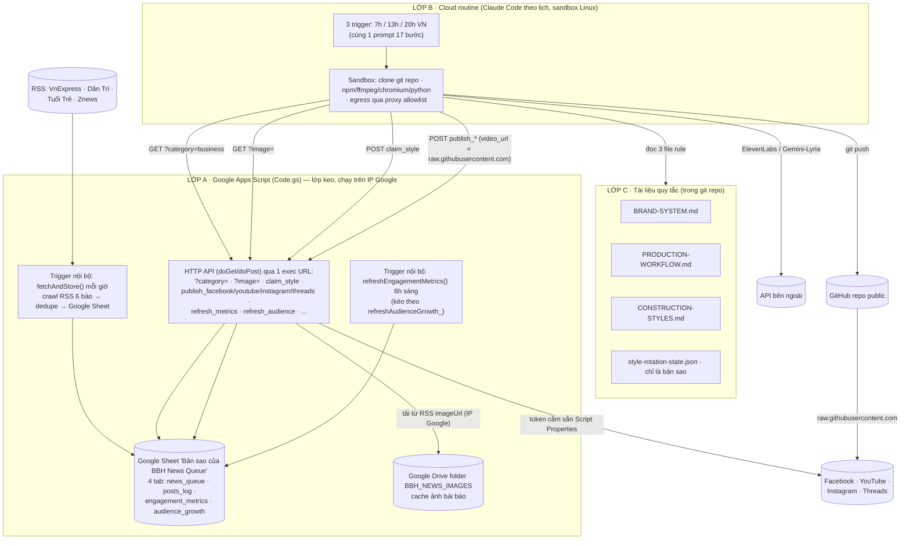

# PIPELINE PLAYBOOK — Hệ thống tự động tìm tin → sản xuất video → đăng đa nền tảng

> **Mục đích**: đóng gói toàn bộ quy trình kỹ thuật của kênh **"BOT BÁN HÀNG · KINH DOANH"**
> (tên hiển thị YouTube: "Kinh Tế Số") để một AI (Claude hoặc tương đương) khác đọc là hiểu được
> kiến trúc, các cài đặt cụ thể, và tự dựng lại / vận hành một hệ thống tương tự.
>
> File này là **bản đồ tổng**. Chi tiết từng phần nằm ở các file cùng repo:
> - `videos/BRAND-SYSTEM-BOT-BAN-HANG.md` — quy tắc thương hiệu (màu, font, cấu trúc act, giọng đọc, bài học GSAP/CSS)
> - `videos/PRODUCTION-WORKFLOW-BOT-BAN-HANG.md` — runbook thao tác từng bước + nhật ký sự cố (§10)
> - `videos/CONSTRUCTION-STYLES-BOT-BAN-HANG.md` — 10 "cách dựng" xoay vòng
> - `videos/automation/news-fetch-gas/SETUP.md` — chi tiết dựng Apps Script + đăng ký token từng nền tảng
> - `videos/automation/news-fetch-gas/NEW-CHANNEL-SETUP.md` — checklist nhân bản cho tuyến nội dung khác
> - `videos/automation/news-fetch-gas/Code.gs` — mã nguồn lớp keo (Google Apps Script)
>
> Cập nhật lần cuối: 2026-09-08. Apps Script đang chạy: **Phiên bản 37**.

---

## 0. Tóm tắt trong 30 giây

Mỗi ngày 3 lần (7h / 13h / 20h giờ Việt Nam), một **routine cloud** (Claude Code chạy theo lịch
trên hạ tầng claude.ai) tự:

1. Lấy danh sách tin tức mới (một Google Apps Script đã crawl RSS 6 báo VN mỗi giờ và dedupe vào Google Sheet).
2. Chọn 1 tin nóng, tải ảnh minh hoạ thật của bài báo (Apps Script tải hộ, không đụng CDN báo).
3. Nhận "cách dựng" (1 trong 10 style) theo vòng xoay có khoá chống trùng.
4. Viết kịch bản → sinh giọng đọc (ElevenLabs) → dựng video HTML (HyperFrames) → nhạc nền (Google Lyria) → render MP4 9:16 dài < 60s.
5. Verify (thời lượng, khoảng lặng, hình ảnh, phiên âm ngược).
6. Commit + push lên GitHub (public repo).
7. Đăng lên **5 kênh**: Facebook Reel + Facebook Story, YouTube Shorts, Instagram Reel, Threads — tất cả qua cùng 1 endpoint Apps Script đã cắm sẵn token.
8. Ghi log vào Google Sheet; số liệu tương tác + lượt theo dõi được refresh mỗi ngày.

Không có server riêng. Không có MCP connector. Mọi thứ ra ngoài đều đi qua **1 URL luôn gọi được**:
`script.google.com/macros/s/.../exec`.

---

## 1. Kiến trúc — 3 lớp



### Vì sao kiến trúc này

| Ràng buộc | Giải pháp |
|---|---|
| Sandbox cloud đi qua **egress proxy chỉ cho phép domain trong allowlist** | Mọi thứ "lạ" (token social, ảnh CDN báo, tạo Sheet...) làm ở **Apps Script** (chạy trên IP Google, không qua proxy). Sandbox chỉ cần với tới `script.google.com` + vài domain cố định. |
| Không muốn cắm MCP connector / không có server riêng | Apps Script Web App = 1 HTTP endpoint công khai, `doGet`/`doPost`, đủ dùng. |
| Token Facebook/YouTube/Threads không được để lộ và Claude Code **không được tự nhập token vào UI** | Token nằm trong **Script Properties** của Apps Script (người vận hành nhập tay 1 lần). Routine chỉ gọi action, không bao giờ thấy token. |
| Ảnh bài báo nằm ở CDN riêng của báo (`icdn.dantri.com.vn`, `i1-*.vnecdn.net`...) — chập chờn / không allowlist | Apps Script parse `imageUrl` từ RSS lúc crawl, và route `GET ?image=<newsId>` tải hộ ảnh từ IP Google rồi cache Drive, trả base64. Routine KHÔNG bao giờ curl thẳng CDN báo. |
| 2 routine chạy gần nhau chọn trùng "cách dựng" | `POST claim_style` cấp chỉ số style kế tiếp dưới `LockService` (khoá). |
| Facebook cần tải video/ảnh từ URL công khai | Repo GitHub để **public** → dùng `raw.githubusercontent.com/.../output/<slug>.mp4` làm `video_url`. |

---

## 2. Bảng kê tài khoản / ID / URL / secret (inventory)

> Đây là cấu hình **thật đang chạy**. Khi nhân bản cho tuyến khác, mọi giá trị "riêng của kênh"
> phải tạo mới (xem `NEW-CHANNEL-SETUP.md`).

### 2.1 Tài khoản

| Thành phần | Giá trị | Ghi chú |
|---|---|---|
| Google account chạy Apps Script | `minhanhh1108@gmail.com` | **Gmail cá nhân, KHÔNG Workspace** — Workspace chặn Apps Script chia sẻ "Anyone" bởi chính sách quản trị (đã thử `@botbanhang.vn` → 403 anonymous). |
| Google account sở hữu Sheet | `quangnv@botbanhang.vn` | Sheet share quyền edit cho `minhanhh1108@gmail.com`. |
| GitHub repo | `github.com/quangnv-cloud/bot-ban-hang-kinh-doanh` | **Public** (không có secret trong repo — `.gitignore` loại `.env`/`node_modules/`/`renders/`/`.claude/`/`.agents/`). Nhánh `master`. |
| claude.ai account chủ routine | tài khoản claude.ai của người vận hành | nơi tạo 3 scheduled trigger + environment |

### 2.2 Apps Script

| Mục | Giá trị |
|---|---|
| Project ID | `1bI4ssGMzHfafDUTjdI-CF9sEoFDgp69812z0T8kMfLS5zZp7AATHZSnQ` (standalone, chưa đặt tên, trong account `minhanhh1108@gmail.com`) |
| Link editor | `https://script.google.com/u/1/home/projects/1bI4ssGMzHfafDUTjdI-CF9sEoFDgp69812z0T8kMfLS5zZp7AATHZSnQ/edit` |
| **Exec URL** (Web App, `/exec`) | `https://script.google.com/macros/s/AKfycbxIQa9BsNnTAsIs2MWBNCsT8zh7_lT9OIKn8srfQ5D3wks0AM88VrjHNvCpYTAEaA7n/exec` |
| Deploy hiện tại | Phiên bản 37 (2026-09-07). Deployment **pin theo version** — mọi sửa `Code.gs` phải Deploy → Quản lý → Phiên bản mới mới có hiệu lực trên URL thật. |
| Deploy config | Web app · Execute as: **Me** · Who has access: **Anyone** |

### 2.3 Google Sheet (đang chạy)

| Mục | Giá trị |
|---|---|
| **Spreadsheet ID (LIVE)** | `1isvFaqM9g6F8hFb3Fu5pvMg2Jgj017Nsh6R0OgHsof0` — tên file "**Bản sao của** BBH News Queue" |
| ⚠️ File cũ đã bỏ | `1crUZGUuX4jA9PvHo-0USpLf6J5KPJycMQLZcwrA6boM` ("BBH News Queue", không có "Bản sao của"). Còn dữ liệu cũ trông y hệt — **dễ sửa nhầm**. |
| Cách xác nhận đúng file | `POST <exec> {"action":"get_sheet_url"}` → trả URL thật. **Luôn gọi cái này trước khi sửa tay bất kỳ ô nào.** |
| Locale / Timezone | Apps Script tự pin về `vi_VN` / `Asia/Ho_Chi_Minh` mỗi lần chạy (tránh lỗi phân tích ngày dd/MM vs MM/DD). |
| Tab | `news_queue`, `posts_log`, `engagement_metrics`, `audience_growth` (schema ở §3.2) |

### 2.4 Cloud routine (claude.ai/code)

| Mục | Giá trị |
|---|---|
| Environment ID | `env_01Prtq2F5hNPLxk3EW2maFA8` (tên "Default") |
| Model | `claude-sonnet-5` |
| `allowed_tools` | `Bash, Read, Write, Edit, Glob, Grep, WebFetch` |
| Source | `git_repository: https://github.com/quangnv-cloud/bot-ban-hang-kinh-doanh` (sparse checkout tắt — clone cả repo) |
| Trigger sáng | `trig_01RdHP4oNHzaYm5UMjuZxWzb` · cron `0 0 * * *` (UTC) = **07:00 VN** |
| Trigger chiều | `trig_01HWAjgP7cpWSiprRfpJ68ap` · cron `0 6 * * *` = **13:00 VN** |
| Trigger tối | `trig_01Y4gS5dsfucSEmBv7HQBL49` · cron `0 13 * * *` = **20:00 VN** |
| Trạng thái | Cả 3 `enabled: true`. Prompt 17 bước giống hệt nhau (chỉ khác `name`). |

### 2.5 Kênh mạng xã hội

| Nền tảng | Định danh | Cơ chế xác thực |
|---|---|---|
| Facebook Page | "Kinh Tế Số", Page ID `1276081382253398` | System User Page Access Token (không hết hạn) — `FB_PAGE_ACCESS_TOKEN` + `FB_PAGE_ID` |
| Instagram | `@bbhkinhteso` (Business/Creator, liên kết Page) | Dùng lại `FB_PAGE_ACCESS_TOKEN` (cần quyền `instagram_basic` + `instagram_content_publish` + `instagram_manage_insights`); IG Business Account ID **derive** từ Page |
| YouTube | Kênh "Kinh Tế Số" (channel ID lấy qua `channels.list?part=id&mine=true` với chính refresh token này) | OAuth2 refresh token (tài khoản Google **khác** account chạy Apps Script) — `YOUTUBE_CLIENT_ID` / `_SECRET` / `_REFRESH_TOKEN`, scope `youtube.upload` + `youtube.readonly` |
| Threads | `@bbhkinhteso` (Threads Tester) | `THREADS_ACCESS_TOKEN` (long-lived ~60 ngày, tạo qua "Công cụ tạo mã người dùng" của Meta) + `THREADS_USER_ID` + `THREADS_APP_ID` + `THREADS_APP_SECRET` |

### 2.6 API sản xuất

| Dịch vụ | Dùng cho | Cấu hình |
|---|---|---|
| ElevenLabs | Giọng đọc | `ELEVENLABS_API_KEY` (env var của environment). Model **`eleven_v3`** (KHÔNG `eleven_multilingual_v2` — model đó không có tiếng Việt). Voice `RCmOaM1iiIH5xX3QXjIF` ("Khánh Lâm - tin tức, thời sự"). Gói trả phí. |
| Google Lyria RealTime (qua Gemini API) | Nhạc nền (BGM) | `GEMINI_API_KEY` (env var). Script `lyria-recipe.py` của skill `media-use`. |
| Google Gemini (`gemini-flash-latest`) | Phiên âm ngược để verify (thay Whisper) | Cùng `GEMINI_API_KEY`. Dùng vì host model của `openai-whisper` không nằm trong egress allowlist. |

---

## 3. LỚP A — Google Apps Script (`videos/automation/news-fetch-gas/Code.gs`)

### 3.1 Vai trò

1. **Crawl tin**: `fetchAndStore()` chạy mỗi giờ (trigger `installHourlyTrigger`). Duyệt mảng `FEEDS`, thêm mọi link chưa có vào tab `news_queue`, đồng thời parse URL ảnh minh hoạ từ RSS (`<enclosure>` hoặc `` trong `<description>` hoặc `<media:content>`).
2. **API cho routine**: `doGet` / `doPost` — xem §3.3.
3. **Đăng bài hộ**: các action `publish_*` gọi Graph API / YouTube API / Threads API bằng token trong Script Properties.
4. **Phục vụ ảnh**: `GET ?image=<newsId>` tải ảnh bài báo từ IP Google, cache vào Drive folder `BBH_NEWS_IMAGES`, trả base64 JSON.
5. **Cấp style**: `POST claim_style` — cấp chỉ số style kế tiếp dưới `LockService`.
6. **Theo dõi số liệu**: `refreshEngagementMetrics()` (6h sáng) + `refreshAudienceGrowth_()` (kèm theo).

### 3.2 Schema Google Sheet

**Tab `news_queue`** (cột A→L, `HEADERS` trong code):

| Cột | Tên | Ý nghĩa |
|---|---|---|
| A | `id` | 12 ký tự đầu của MD5(link) — khoá dedupe |
| B | `title` | tiêu đề bài |
| C | `link` | URL bài gốc |
| D | `source` | `VnExpress` / `Dan Tri` / `Tuoi Tre` / `Znews` |
| E | `category` | `general` / `business` |
| F | `pubDate` | ISO — ngày đăng của báo |
| G | `fetchedAt` | ISO — lúc crawl |
| H | `used` | `TRUE`/`FALSE` — đã dùng làm video chưa |
| I | `usedAt` | ISO — lúc đánh dấu used |
| J | `usedByVideo` | slug project video đã dùng tin này |
| K | `imageUrl` | URL ảnh minh hoạ parse từ RSS |
| L | `imageFileId` | Drive file ID sau khi cache (lazy, điền khi `?image=` gọi lần đầu) |

`doGet` trả thêm trường phái sinh `hasImage: true/false` (không trả `imageFileId`).
`FEEDS` hiện tại:
```
VnExpress general  https://vnexpress.net/rss/tin-moi-nhat.rss
VnExpress business https://vnexpress.net/rss/kinh-doanh.rss
Dan Tri   general  https://dantri.com.vn/rss/home.rss
Dan Tri   business https://dantri.com.vn/rss/kinh-doanh.rss
Tuoi Tre  general  https://tuoitre.vn/rss/tin-moi-nhat.rss
Znews     business https://znews.vn/rss/kinh-doanh-tai-chinh.rss
```
`MAX_AGE_HOURS_FOR_API = 30` — `doGet` chỉ trả tin `pubDate` trong 30 giờ gần nhất.

**Tab `posts_log`** (`POSTS_HEADERS`): `posted_at, channel, post_type, video_project, title, caption, platform_post_id, permalink, status, posted_by, notes`
- `channel`: `facebook` | `instagram` | `youtube` | `threads` (viết thường ở đây)
- `post_type`: `reel` | `story` | `short` | (dữ liệu cũ: `video`, `video_feed`)
- `status`: `published` | `failed` | `deleted`
- Mọi action `publish_*` tự ghi 1 dòng ở đây (kể cả khi lỗi).

**Tab `engagement_metrics`** (`ENGAGEMENT_HEADERS` nội bộ · `ENGAGEMENT_HEADER_LABELS` tiếng Việt hiển thị):
`channel(Kênh) · video_project(Dự án video) · post_type(Loại bài đăng) · platform_post_id(Mã bài đăng) · permalink(Liên kết bài đăng) · title(Tiêu đề) · posted_at(Thời gian đăng UTC) · posted_date(Ngày đăng) · posted_time(Giờ đăng) · views(Lượt xem) · likes(Lượt thích) · reactions(Cảm xúc) · comments(Bình luận) · shares(Lượt chia sẻ) · last_checked(Lần kiểm tra cuối) · notes(Ghi chú)`
- **Ghi đè toàn bộ mỗi lần refresh** (full rebuild), 1 dòng / (kênh × video).
- `posted_date` ghi là **Date object thật** (không phải chuỗi) + format ô `dd/mm/yyyy` → tránh Looker Studio hiểu nhầm dd/MM ↔ MM/DD.
- Cột số luôn hiện `0` (không để trống) khi không lấy được, lý do ghi vào `notes`.
- Header row tự viết lại mỗi lần chạy (self-heal) — đổi nhãn không cần xoá tab.

**Tab `audience_growth`** (`AUDIENCE_HEADER_LABELS`): `Kênh · Thời gian kiểm tra (UTC) · Ngày · Giờ · Lượt theo dõi · Ghi chú`
- **Upsert theo (kênh, ngày)** — gọi lại nhiều lần trong cùng ngày chỉ ghi đè dòng của ngày đó, KHÔNG thêm dòng (tránh Looker SUM cộng dồn).
- 1 dòng / kênh / ngày. Threads: cột "Lượt theo dõi" để trống + ghi chú "API chưa hỗ trợ".

### 3.3 HTTP API — tất cả endpoint

Base URL = exec URL ở §2.2. Mọi POST gửi `Content-Type: application/json`.

**GET:**

| Request | Trả về |
|---|---|
| `GET ?category=business` | `{"items":[ {id,title,link,source,category,pubDate,fetchedAt,used,usedAt,usedByVideo,imageUrl,hasImage}, ... ]}` — tin `business` chưa dùng, mới nhất trước |
| `GET` (không param) | như trên nhưng cả `general` + `business` |
| `GET ?image=<newsId>` | `{"ok":true,"mime":"image/jpeg","filename":"<id>.jpg","cached":true/false,"data":"<base64>"}` hoặc `{"ok":false,"error":"..."}` |
| `GET ?style_state` | như action `style_state` bên dưới |

**POST — đánh dấu tin đã dùng:**
```json
{"id": "<news id>", "video": "<slug project>"}   →  {"ok":true}
```

**POST — cấp / xem "cách dựng":**

| Body | Trả về |
|---|---|
| `{"action":"claim_style","video":"<slug>"}` | `{"ok":true,"index":N,"style":"N-tên","claimed_at":"..."}` — cấp chỉ số kế tiếp dưới LockService |
| `{"action":"style_state"}` | `{"ok":true,"last_used_index":N,"last_used_style":"...","next_index":N+1,"next_style":"...","rotation":[10 tên]}` |
| `{"action":"set_style_cursor","index":N}` | ép con trỏ (admin/recovery). `0 ≤ N ≤ 9` |

**POST — đăng bài** (chỉ gọi SAU khi đã `git push` vì các nền tảng tải video/ảnh từ `raw.githubusercontent.com`):

| Body | Ghi chú |
|---|---|
| `{"action":"publish_facebook","video_url","caption","video","title","thumbnail_url"}` | Đăng Reel. `thumbnail_url` **bắt buộc** (Facebook tự chọn khung tối/xấu nếu thiếu). |
| `{"action":"publish_facebook_photo","image_url","caption","video","title"}` | Đăng ảnh làm **Story** ("Tin"), tự hết hạn ~24h. **Nội dung FB mỗi video = đúng 2 phần: 1 Reel + 1 Story.** |
| `{"action":"publish_youtube","video_url","title","description","privacy":"public","video","thumbnail_url"}` | Đăng Shorts. Tiêu đề tự viết hoa. Set thumbnail có **retry 5 lần / ~130s** (video vừa upload thường chưa nhận thumbnail). |
| `{"action":"publish_instagram","video_url","caption","video","title","thumbnail_url"}` | Reel. Đồng bộ, có thể mất ~2.5 phút. `thumbnail_url` bắt buộc. |
| `{"action":"publish_threads","video_url","caption","video","title"}` | Threads **KHÔNG** nhận `thumbnail_url` (API chưa hỗ trợ). Có thể mất ~1-2 phút. |

Cả 5 action trên: (a) tự ghi `posts_log`; (b) có **guard chống trùng** `alreadyPublished_` — nếu đã có dòng `published` khớp `channel + video + post_type` thì từ chối, trừ khi truyền `"force": true`.

**POST — theo dõi số liệu:**

| Body | Ghi chú |
|---|---|
| `{"action":"refresh_metrics"}` | Rebuild tab `engagement_metrics` từ `posts_log` (đọc số liệu 4 nền tảng). Kéo theo `refresh_audience`. Cũng chạy tự động 6h sáng. |
| `{"action":"refresh_audience"}` | Upsert tab `audience_growth` (lượt theo dõi / subscriber từng kênh). |

**POST — chẩn đoán / dọn dẹp (read-only trừ khi nói khác):**

| Body | Ghi chú |
|---|---|
| `{"action":"list_yt_content"}` | Liệt kê toàn bộ video thật của kênh YouTube (`search.list forMine=true`) |
| `{"action":"list_fb_content"}` | Liệt kê video/Reel thật của Page |
| `{"action":"list_posts","limit":20,"channel":"facebook"}` | N dòng cuối `posts_log` |
| `{"action":"check_instagram"}` | Xác nhận token Page thấy được IG Business Account (không đăng gì) |
| `{"action":"yt_set_thumbnail","video_id","thumbnail_url"}` | Set lại ảnh bìa YouTube thủ công, **trả lỗi thật** (không nuốt). Dùng để sửa video cũ. |
| `{"action":"yt_set_thumbnail_b64","video_id","image_base64","mime_type"}` | Như trên nhưng ảnh gửi base64 trực tiếp (khôi phục khẩn cấp) |
| `{"action":"fb_delete_content","id"}` | Xoá 1 video/Reel FB qua Graph API (cần id rõ ràng, không bulk) |
| `{"action":"threads_delete_content","id"}` | Xoá 1 post Threads (cần quyền `threads_delete` — token hiện tại chưa có) |
| `{"action":"get_sheet_url"}` | Trả URL Google Sheet thật (`SPREADSHEET_ID`) |
| `{"action":"log_post", ...POSTS_HEADERS}` | Ghi thủ công 1 dòng `posts_log` (backfill / kênh chưa có pipeline) |

### 3.4 Script Properties (Cài đặt dự án → Thuộc tính của tập lệnh)

| Tên | Nguồn lấy | Bắt buộc? | Ghi chú |
|---|---|---|---|
| `SPREADSHEET_ID` | Script tự tạo Sheet lần chạy đầu và lưu lại | Tự động | Không cần tạo Sheet trước |
| `NEWS_IMAGE_FOLDER_ID` | Script tự tạo Drive folder `BBH_NEWS_IMAGES` | Tự động | |
| `STYLE_CURSOR` | `claim_style` tự cập nhật (seed = `STYLE_CURSOR_SEED` trong code nếu chưa set) | Tự động | Tuyến mới: sửa `STYLE_CURSOR_SEED = 9` để video đầu tiên = index 0 |
| `STYLE_CLAIM_LOG` | `claim_style` tự ghi (20 lần gần nhất) | Tự động | |
| `FB_PAGE_ACCESS_TOKEN` | Meta for Developers → System User token, quyền `pages_manage_posts, pages_read_engagement, pages_show_list, instagram_basic, instagram_content_publish, instagram_manage_insights` | **Người nhập** | Không hết hạn (`expires_at: 0`) |
| `FB_PAGE_ID` | ID Fanpage (không phải tên) | **Người nhập** | |
| `YOUTUBE_CLIENT_ID` | Google Cloud Console → OAuth Client | **Người nhập** | |
| `YOUTUBE_CLIENT_SECRET` | như trên | **Người nhập** | |
| `YOUTUBE_REFRESH_TOKEN` | OAuth Playground, scope `youtube.upload` + `youtube.readonly`, đăng nhập bằng tài khoản kênh | **Người nhập** | Thiếu `youtube.readonly` → đăng được nhưng đọc số liệu 403 |
| `THREADS_ACCESS_TOKEN` | Threads API → Cài đặt → "Công cụ tạo mã người dùng" | **Người nhập** | Long-lived ~60 ngày, **phải tạo lại thủ công định kỳ** |
| `THREADS_USER_ID` | `GET graph.threads.net/v1.0/me?fields=id,username` | **Người nhập** | |
| `THREADS_APP_ID` / `THREADS_APP_SECRET` | Threads API → Cài đặt (khác App ID chính của Meta app) | **Người nhập** | |

> **Nguyên tắc an toàn**: Claude Code KHÔNG được tự nhập token vào bất kỳ field cấu hình nào (kể cả
> Script Properties) dù người dùng đã đưa token và đồng ý — chỉ được *dùng* token để gọi API. Bước
> nhập Script Properties luôn do người vận hành làm tay.

### 3.5 Trigger nội bộ Apps Script

| Hàm | Lịch | Cài bằng |
|---|---|---|
| `fetchAndStore` | mỗi 1 giờ | chạy `installHourlyTrigger()` 1 lần trong editor |
| `refreshEngagementMetrics` | mỗi ngày 6h sáng | chạy `installDailyMetricsTrigger()` 1 lần trong editor |

### 3.6 Deploy `Code.gs` (khi sửa code)

1. Mở editor (account `minhanhh1108@gmail.com`).
2. Ctrl+A → Ctrl+V dán toàn bộ file mới (paste xử lý ~90KB tốt; gõ mô phỏng thì KHÔNG).
   - ⚠️ Paste đôi khi **thất bại âm thầm**. Sau khi dán, kiểm tra `monaco.editor.getModels()[0].getValue().length` == độ dài file. Nếu = 0 hoặc sai → `Ctrl+Z` khôi phục, đừng lưu.
3. `Ctrl+S` → chờ "Đã lưu vào Drive".
4. **Triển khai → Quản lý các tùy chọn triển khai → (bút chì) → dropdown "Phiên bản" → chọn "Phiên bản mới" → Triển khai.**
   - ⚠️ Xác nhận field version thật sự hiện **"Phiên bản mới"** trước khi bấm Triển khai — một cú click lệch có thể chọn nhầm version cũ và **rollback deployment về code cũ**.
5. Exec URL không đổi. Đồng bộ file local (`Code.gs` trong repo) khớp bản đã deploy — không có cơ chế 2 chiều.

---

## 4. LỚP B — Cloud routine

### 4.1 Environment `env_01Prtq2F5hNPLxk3EW2maFA8` (claude.ai/code → environment settings)

**Network access = "Custom"** (chuyển từ "Trusted"). Allowlist gồm:

*Giữ npm/pip/git hoạt động:*
`api.anthropic.com` (+ biến thể), `registry.npmjs.org`, `jsr.io`, `npm.jsr.io`, `pypi.org`, `files.pythonhosted.org`, `index.crates.io`, `proxy.golang.org`, `github.com`, `raw.githubusercontent.com`, `objects.githubusercontent.com`

*Domain của dự án:*
`api.elevenlabs.io`, `generativelanguage.googleapis.com` (Gemini/Lyria), `script.google.com`, `script.googleusercontent.com` (Apps Script Web App), `oauth2.googleapis.com`, `www.googleapis.com`, `graph.facebook.com`, `graph.threads.net`

> **Lưu ý**: KHÔNG cần thêm domain CDN ảnh báo nữa (đã dời sang Apps Script `?image=`).
> `cdn.jsdelivr.net` KHÔNG có trong allowlist → GSAP phải **vendor local** (`npm install gsap`,
> copy `node_modules/gsap/dist/gsap.min.js` → `assets/vendor/gsap.min.js`). Host model của
> `openai-whisper` cũng không có → verify phiên âm bằng **Gemini** thay Whisper.

**Environment variables** (ô "Environment variables", plaintext — chấp nhận vì environment riêng tư):
`ELEVENLABS_API_KEY`, `GEMINI_API_KEY`

### 4.2 GitHub — quyền ghi

- Cài **Claude GitHub App** (`github.com/apps/claude/installations/select_target`) lên account/org `quangnv-cloud`, rồi reconnect GitHub Integration ở claude.ai Settings → Connectors.
- Repo **public** để routine đọc được (connector chỉ verify identity, không có repo-picker); public fix *read*, GitHub App install fix *write*.
- Verify write bằng 1 trigger throwaway đẩy branch test (đừng chạy 1 trong 3 trigger thật để "test nhỏ" — `RemoteTrigger run` **luôn** chạy nguyên prompt sản xuất, không override được qua `body`).

### 4.3 Prompt routine (17 bước)

Prompt đầy đủ nằm trong cấu hình trigger (`RemoteTrigger get <trigger_id>` → `derived_state.prompt`).
Tóm tắt vai trò từng bước:

| Bước | Việc | Endpoint / công cụ chính |
|---|---|---|
| (đầu) | Đọc kỹ 3 file: `BRAND-SYSTEM`, `PRODUCTION-WORKFLOW`, `CONSTRUCTION-STYLES` — "toàn bộ quy tắc bắt buộc" | Read |
| 1 | Lấy danh sách tin (`?category=business` + không filter), chọn 1 tin nóng nhất (ưu tiên `hasImage:true` + có số liệu). POST `{id, video}` đánh dấu used. Tải ảnh Hook: `GET ?image=<id>` → base64 → file. **TUYỆT ĐỐI không curl thẳng CDN báo.** | Apps Script GET/POST |
| 2 | `POST claim_style` → nhận `index` + `style` (KHÔNG đọc `style-rotation-state.json` để lấy chỉ số) | Apps Script POST |
| 3 | Viết `BRIEF.md` + `SCRIPT.md`. **`SCRIPT.md` KHÔNG viết tắt** (ElevenLabs đọc y văn bản: "Tp.HCM"→"Thành phố Hồ Chí Minh", "DNVVN"→"doanh nghiệp vừa và nhỏ", "km"→"ki-lô-mét"...). `BRIEF.md` + text trên video vẫn viết tắt được. | Write |
| 4 | Sinh voice ElevenLabs (từng dòng 1 file mp3), `eleven_v3`, `RCmOaM1iiIH5xX3QXjIF` | `$ELEVENLABS_API_KEY` |
| 5 | Dựng composition 7 act theo style đã nhận; Hook + Brand Anchor cố định; act cuối là sự thật/số liệu (không suy đoán). Ảnh Hook/Article Image Card = file đã tải ở bước 1. | HyperFrames (`hyperframes init`), viết `compositions/frames/*.html` + `index.html` |
| 6 | BGM Google Lyria (`lyria-recipe.py`, **luôn** `--negative-prompt "vocals, lyrics, singing, choir, rap, spoken word, humming"` — BGM 100% không lời) + SFX + `carve.mjs` (duck nhạc dưới giọng) | `$GEMINI_API_KEY` |
| 7 | `npm run check` — fix hết **error** trước khi render | `npx hyperframes check` |
| 8 | Cài `ffmpeg` (`sudo apt-get install -y ffmpeg`) → `npm run render` → verify §7 workflow (ffprobe, silencedetect, frame QA, phiên âm Gemini, **soát lỗi đọc lắp do viết tắt**). Fail hoàn toàn → DỪNG. | ffmpeg, Gemini |
| 9 | Xuất thumbnail: `ffmpeg -ss 3.5 -i output/<slug>.mp4 -frames:v 1 -q:v 2 output/thumbnail.jpg` (giây 3–5 trong Hook, sau khi animation ổn định). Verify bằng mắt qua Read. | ffmpeg |
| 10 | Thêm 1 dòng vào `log` của `style-rotation-state.json` (KHÔNG sửa `last_used_index` — con trỏ thật do Apps Script quản lý) | Edit |
| 11 | `git commit` + `git push` cả project (video + thumbnail vào `output/`, trừ `node_modules/`) | git |
| 12 | Viết caption Facebook (emoji + tiêu đề IN HOA + 2-3 đoạn số liệu + "📌 Nguồn: ..." + hashtag `#BotBanHang #TinTucKinhDoanh` + 4-6 hashtag). **Không bịa số liệu ngoài `BRIEF.md`/`SCRIPT.md`.** | Write |
| 13 | `POST publish_facebook` (Reel) + `POST publish_facebook_photo` (Story) — `video_url`/`thumbnail_url` = `raw.githubusercontent.com/.../output/...` | Apps Script POST |
| 14 | `POST publish_youtube` | Apps Script POST |
| 15 | `POST publish_instagram` (chờ ~2.5 phút) | Apps Script POST |
| 16 | `POST publish_threads` (không thumbnail; chờ ~1-2 phút) | Apps Script POST |
| 17 | Tóm tắt cuối: tin + nguồn, style + index, thời lượng, kết quả verify, đường dẫn repo, kết quả đăng từng kênh (post id / permalink). **Nếu bước 1-11 fail → DỪNG, không đăng, báo lỗi rõ ràng.** | PushNotification + text |

**Cập nhật prompt routine**: `RemoteTrigger update <trigger_id>` với `body: {"prompt": "<toàn văn>"}` —
là partial update, giữ `enabled`/`cron`, bump `updated_at`. 3 trigger prompt giống hệt nhau nên gửi
cùng body cho cả 3.

---

## 5. LỚP C — Tài liệu quy tắc (living docs)

| File | Nội dung cốt lõi |
|---|---|
| `BRAND-SYSTEM-BOT-BAN-HANG.md` | Màu `#E8441E`/`#FFFFFF`/`#111111`; font Montserrat; **cấu trúc 7 act** (act cuối = sự thật/số liệu đã xảy ra, KHÔNG "Takeaway" suy đoán); thời lượng < 60s linh hoạt; **BGM luôn 100% instrumental**; **Article Image System** (ảnh trong "Article Image Card", không full-bleed, có badge "BOT BÁN HÀNG"); mục **Voiceover** (`eleven_v3`, voice id, **bảng quy đổi viết tắt cho SCRIPT.md**, verify phiên âm ngược); danh sách bài học GSAP/CSS tái diễn. |
| `PRODUCTION-WORKFLOW-BOT-BAN-HANG.md` | Runbook 8 mục: chọn tin & kịch bản → voice → composition → BGM/SFX → lint/QA → render → verify (§7) → thumbnail (§7.5) → giao/đăng. **§10 = nhật ký sự cố hạ tầng** (đọc để không phát hiện lại lỗi cũ). |
| `CONSTRUCTION-STYLES-BOT-BAN-HANG.md` | 10 "cách dựng" có tên (Card & Bar, Chip & Leaderboard, Ticker Tape, Split Comparison, Map & Geo, Ring Progress, Timeline Chronology, Icon Grid, Editorial Clipping, Stock Terminal). Hook + Brand Anchor cố định; chỉ 5 act giữa đổi theo style. |
| `style-rotation-state.json` | **Chỉ là bản sao cho người đọc** — nguồn sự thật của con trỏ là Script Property `STYLE_CURSOR`. Routine vẫn thêm dòng `log` sau mỗi video. |

> Cả 3 file .md là **living docs** — mỗi khi phát sinh bài học/quy tắc mới thì cập nhật ngay, để
> phiên sau (hoặc AI khác) không phải phát hiện lại.

---

## 6. Quy trình sản xuất 1 video — chi tiết

> Đây là những gì routine làm ở bước 3–11. Có thể chạy tay để hiểu / debug.

### 6.1 Chọn tin
```bash
EXEC="https://script.google.com/macros/s/AKfycbxIQa9BsNnTAsIs2MWBNCsT8zh7_lT9OIKn8srfQ5D3wks0AM88VrjHNvCpYTAEaA7n/exec"
curl -sL "$EXEC?category=business" | jq '.items[] | {id, title, source, hasImage}'
# chọn 1 tin có hasImage:true, số liệu rõ, chưa cũ
curl -sL -X POST "$EXEC" -H 'Content-Type: application/json' \
  -d '{"id":"<id>","video":"<slug-tin>"}'
```

### 6.2 Nhận style
```bash
curl -sL -X POST "$EXEC" -H 'Content-Type: application/json' \
  -d '{"action":"claim_style","video":"<slug-tin>"}'
# → {"ok":true,"index":4,"style":"5-map-and-geo"}
```

### 6.3 Tải ảnh Hook
```bash
curl -sL "$EXEC?image=<id>" | jq -r '.data' | base64 -d > hook-photo.jpg
# nếu {"ok":false} → chọn tin khác hasImage:true
```

### 6.4 Khởi tạo project + viết kịch bản
```bash
npx hyperframes@0.8.27 init videos/<slug-tin>   # KHÔNG copy state từ project cũ
# viết videos/<slug-tin>/BRIEF.md  (mục tiêu, nguồn, số liệu chính)
# viết videos/<slug-tin>/SCRIPT.md (mỗi dòng = 1 act, MỘT dòng = MỘT act, KHÔNG viết tắt)
```

### 6.5 Sinh giọng đọc (từng dòng)
```python
# POST https://api.elevenlabs.io/v1/text-to-speech/RCmOaM1iiIH5xX3QXjIF
# headers: xi-api-key: $ELEVENLABS_API_KEY
# body: {"text": "<dòng script>", "model_id": "eleven_v3"}
# lưu line1.mp3, line2.mp3, ... vào assets/voice/
# đo: ffprobe -v error -show_entries format=duration -of default=nk=1:nw=1 line1.mp3
```
`data-duration` mỗi frame = độ dài voice thật của dòng đó **+ đệm 0.3–0.5s**.

### 6.6 Dựng composition
- `compositions/frames/01-hook.html` ... `06-impact.html` (7 act, nhưng thường 6 frame + brand anchor).
- Hook = title-card: ảnh thật (nửa trên) → panel tối (nửa dưới): masthead "Bot Bán Hàng" + badge "Nguồn: … · [ngày]" + tiêu đề lớn (số liệu to nhất).
- Brand Anchor (logo góc dưới-phải + "Nguồn:" góc dưới-trái) dựng ở tầng root `index.html`, hiện từ sau Hook.
- GSAP vendor local: `<script src="assets/vendor/gsap.min.js">`.
- 5 act giữa dựng theo định hướng ẩn dụ của style (mô tả trong `CONSTRUCTION-STYLES` chỉ là định hướng — vẫn phải tự thiết kế HTML/CSS/GSAP).

### 6.7 BGM + SFX + carve
```bash
python3 <media-use skill>/audio/scripts/lyria-recipe.py \
  --output assets/bgm/track-raw.wav --duration <TOTAL+đệm> \
  --prompt "modern business news underscore, digital, fast-paced, minimal, professional, instrumental only" \
  --negative-prompt "vocals, lyrics, singing, choir, rap, spoken word, humming"
ffmpeg -y -i assets/bgm/track-raw.wav -t <TOTAL> -af "afade=t=out:st=<TOTAL-3>:d=3" -c:a libmp3lame -q:a 2 assets/bgm/track.mp3
# gắn data-audio-group="voiceover" cho mọi <audio> giọng đọc
npm install -D @hyperframes/core@0.8.27
node <hyperframes-audio skill>/scripts/carve.mjs --comp index.html
```

### 6.8 Check + render
```bash
npm run check          # fix hết ERROR (warning xem xét từng cái)
sudo apt-get update && sudo apt-get install -y ffmpeg
npm run render         # → renders/<slug>_<timestamp>.mp4
mkdir -p output && cp renders/<slug>_*.mp4 output/<slug>.mp4
```

### 6.9 Thumbnail
```bash
ffmpeg -y -ss 3.5 -i output/<slug>.mp4 -frames:v 1 -q:v 2 -update 1 output/thumbnail.jpg
# Read output/thumbnail.jpg — xác nhận 4 thành phần: ảnh nền + logo/Bot Bán Hàng + nguồn + tiêu đề/số. Đủ rõ, không cắt/mờ.
```

### 6.10 Commit + push
```bash
git add videos/<slug-tin>/ videos/style-rotation-state.json
git commit -m "Add video: <tiêu đề> (style <N> — <tên style>)"
git pull --rebase origin master   # remote thường đã đi trước (routine khác vừa push)
git push origin master
```

---

## 7. Verify / QC — 5 kiểm tra bắt buộc (bước 8)

| # | Kiểm tra | Lệnh | Tiêu chí đạt |
|---|---|---|---|
| 1 | Thời lượng | `ffprobe -v error -show_entries format=duration ...` | khớp thiết kế, < 60s |
| 2 | Khoảng lặng chết | `ffmpeg -i out.mp4 -af silencedetect=noise=-35dB:d=0.6 -f null - 2>&1 \| grep silence` | chỉ có `silence_start` gần cuối (fade BGM), KHÔNG ở giữa |
| 3 | Hình ảnh | trích frame `ffmpeg -ss <t> -frames:v 1` tại vài mốc → Read bằng mắt | khớp thiết kế, contrast text OK, không tràn |
| 4 | Phiên âm ngược | gửi audio wav lên `gemini-flash-latest:generateContent` với prompt "Transcribe the Vietnamese speech verbatim" | khớp `SCRIPT.md`; chấp nhận lỗi ASR nhầm âm gần giống; KHÔNG chấp nhận câu sai cấu trúc/nghĩa |
| 5 | **Lỗi đọc lắp / đánh vần** (do viết tắt lọt vào `SCRIPT.md`) | soát transcript ở #4 | không có địa danh/cụm từ bị đọc rời từng chữ cái. Có → sửa `SCRIPT.md` dạng đầy đủ → sinh lại đúng file voice đó |

BGM cũng phải nghe/xem waveform xác nhận **không dính giọng hát** dù đã có `--negative-prompt`.

---

## 8. Đăng 5 nền tảng (bước 13–16)

Thứ tự: **Facebook Reel → Facebook Story → YouTube → Instagram → Threads.** Chỉ chạy SAU khi
`git push` xong (các nền tảng tải từ `raw.githubusercontent.com`).

```bash
SLUG="<slug-tin>"
RAW="https://raw.githubusercontent.com/quangnv-cloud/bot-ban-hang-kinh-doanh/master/videos/$SLUG/output"
VIDEO="$RAW/$SLUG.mp4"; THUMB="$RAW/thumbnail.jpg"

# verify raw URL sống trước:
curl -sI "$VIDEO" | head -1   # HTTP 200
curl -sI "$THUMB" | head -1

# FB Reel  — POST-302 cần curl -sL không được (đổi POST→GET); dùng: gửi POST, đọc header Location, GET Location thủ công
curl -sD /tmp/h.txt -o /dev/null -X POST "$EXEC" -H 'Content-Type: application/json' -d "$(jq -n \
  --arg v "$VIDEO" --arg t "$THUMB" --arg c "$CAPTION" --arg s "$SLUG" --arg ti "$TITLE" \
  '{action:"publish_facebook",video_url:$v,thumbnail_url:$t,caption:$c,video:$s,title:$ti}')"
LOC=$(grep -i '^location:' /tmp/h.txt | sed 's/^location: //i' | tr -d '\r'); curl -sS "$LOC"
```

Nguyên tắc xử lý lỗi (bước 13–16):
- **Bước sản xuất 1–11 fail → DỪNG, KHÔNG đăng gì, báo lỗi.**
- Bước đăng (12–16) 1 kênh fail → **KHÔNG** coi cả routine fail; ghi rõ vào tóm tắt; phần sản xuất vẫn tính là hoàn tất.
- YouTube: chỉ thumbnail lỗi (403 quyền chưa lan truyền) → video vẫn tính đăng thành công.
- Threads token hết hạn → ghi rõ để người vận hành tạo lại token.

---

## 9. Theo dõi số liệu

| Tab | Cập nhật | Nội dung | Giới hạn nền tảng |
|---|---|---|---|
| `engagement_metrics` | 6h sáng (auto) + `refresh_metrics` | views/likes/reactions/comments/shares mỗi (kênh × video) | FB `shares`/`reactions` breakdown không hợp lệ trên node video → `reactions = likes`, `shares = 0` + ghi notes. FB Reels dùng `blue_reels_play_count`. IG dùng metric `views` (không phải `plays`). YouTube cần scope `youtube.readonly`. |
| `audience_growth` | 6h sáng (kèm theo) + `refresh_audience` | Lượt theo dõi / subscriber mỗi kênh, 1 dòng/ngày (upsert) | YouTube `subscriberCount` ✓. FB `followers_count`/`fan_count` ✓. IG `followers_count` ✓. Threads: API chưa có field → để trống. |

**Demographics (tuổi/giới tính/thiết bị)** — CHƯA làm. Cần: YouTube Analytics API (scope `yt-analytics.readonly` mới, làm lại OAuth Playground); FB/IG chỉ có ở cấp tài khoản tổng (không theo từng video); Threads không hỗ trợ.

---

## 10. Bảng lỗi đã gặp & cách xử lý (đọc kỹ — tiết kiệm nhiều giờ)

| Triệu chứng | Nguyên nhân | Cách xử lý |
|---|---|---|
| Deploy Apps Script trên Workspace: request ẩn danh 403 dù chọn "Anyone" | Chính sách quản trị Workspace đè cài đặt chia sẻ của script | Deploy bằng **Gmail cá nhân** |
| Routine chết ở bước 1: `curl`/`WebFetch` ảnh báo → `EGRESS_BLOCKED` / 403 CONNECT | CDN ảnh báo không / không ổn định trong egress allowlist; host ảnh thật là subdomain khác cái đã thêm (`icdn.` chứ không phải `cdnphoto.`) | Đã dời hẳn: dùng `GET ?image=<newsId>` (Apps Script tải hộ từ IP Google). **Không** đuổi theo allowlist nữa. |
| Từng thử `?image=<url>` proxy — Claude Code tự chối chạy | Endpoint nhận URL bất kỳ = cổng SSRF đi vòng allowlist | Đúng — đừng né. Endpoint hiện chỉ nhận **news id nội bộ** (12 ký tự), URL fetch là cái script tự parse từ RSS cứng. |
| `cdn.jsdelivr.net` 403 (`ERR_TUNNEL_CONNECTION_FAILED`) khi check/render | jsdelivr KHÔNG trong allowlist, KHÁC `registry.npmjs.org` | Vendor GSAP local |
| `pip install openai-whisper` OK nhưng lần chạy đầu 403 (tải model `.pt`) | `openaipublic.azureedge.net` không trong allowlist | Verify phiên âm bằng **Gemini** (`gemini-flash-latest`) — domain đã allowlist |
| Giọng đọc nghe như tiếng nước khác | `eleven_multilingual_v2` KHÔNG hỗ trợ tiếng Việt (dù tên "Multilingual") | Bắt buộc `model_id: eleven_v3`. Kiểm tra `GET /v1/models` trước khi đổi model. |
| Voice đọc "Tp.HCM" sai / đánh vần | ElevenLabs đọc y văn bản, `SCRIPT.md` có viết tắt | **`SCRIPT.md` KHÔNG viết tắt** — viết đầy đủ như cách đọc. Bảng quy đổi ở BRAND-SYSTEM mục Voiceover. `BRIEF.md` + text trên video vẫn viết tắt được. |
| 2 routine cùng khung giờ dựng trùng "cách dựng" | Cùng đọc `last_used_index` trước khi bên nào ghi | `POST claim_style` cấp index dưới `LockService`. `style-rotation-state.json` chỉ còn là bản sao. |
| Sửa tay Google Sheet không thấy tác dụng | **2 Sheet trùng tên** — sửa nhầm bản cũ đã bỏ (`1crUZGU...`) | `POST {"action":"get_sheet_url"}` để biết file thật (`1isvFaqM9g6F8...`) TRƯỚC KHI sửa tay |
| Looker Studio đọc `posted_date` sai tháng (3/9 thành 9/3) | Ghi ngày dưới dạng **chuỗi** "dd/MM/yyyy" → Sheets/Looker re-parse theo locale (nếu không phải VN → hiểu MM/DD) | Ghi **Date object thật** + pin locale bảng tính `vi_VN` + format ô `dd/mm/yyyy` |
| `audience_growth` bị Looker SUM cộng dồn | Gọi `refresh_audience` 2 lần/ngày → 2 dòng/kênh/ngày | Upsert theo (kênh, ngày) — gọi lại chỉ ghi đè |
| YouTube hiện khung giữa video thay vì ảnh bìa thương hiệu, dù routine báo "thumbnail thành công" | `ytPublishVideo_` set thumbnail 1 lần ngay sau upload — lúc video còn processing, bị 4xx / bị YouTube ghi đè | Bản 34+: retry set thumbnail 5 lần (0/25/45/60/60s). Fallback thủ công: `POST yt_set_thumbnail` với raw github URL. |
| Trang "Chi tiết video" trong YouTube Studio hiện ảnh bìa sai (dù ảnh thật đúng) | Studio hiện **khung trình phát dừng ở 0:00** (frame mở đầu, thường nền đen trước khi ảnh fade vào), + Studio cache thu nhỏ riêng, trễ | Kiểm tra ảnh THẬT qua `i.ytimg.com/vi/<id>/maxresdefault.jpg` hoặc `youtube.com/shorts/<id>` — không tin trang edit của Studio |
| Deploy "Phiên bản mới" nhưng thành ra rollback về code cũ | Click lệch trong dropdown version chọn nhầm version cũ | Re-screenshot / re-read field version xác nhận nó nói "Phiên bản mới" ngay trước khi bấm Triển khai |
| Paste `Code.gs` vào Monaco editor không có tác dụng (hoặc editor thành rỗng sau Ctrl+A+Delete) | Ctrl+V đôi khi thất bại âm thầm | Set-Clipboard lại ngay trước Ctrl+V; verify `getValue().length`; nếu bất thường → Ctrl+Z (chưa lưu nên khôi phục được), đừng lưu chồng |
| `RemoteTrigger run` với `body` override — chạy nguyên prompt sản xuất thật | `body` override không áp lên prompt của trigger | KHÔNG dùng `run` trên 3 trigger thật để "test nhỏ". Tạo trigger throwaway prompt tối giản. Không có cách cancel routine đang chạy. |
| git push từ routine 403 (repo đã public) | Public chỉ fix *read*. *Write* cần Claude GitHub App install với write scope | Cài GitHub App lên `quangnv-cloud`, reconnect Connector |
| Facebook POST bị 405 / đổi POST→GET | Apps Script trả 302; `curl -L`/`--post302` xử lý sai | Gửi POST, đọc header `Location` thủ công, `GET` Location đó |
| POST tiếng Việt qua PowerShell biến dấu thành `?` | PowerShell encode sai | `[System.IO.File]::ReadAllBytes()` đọc file JSON → truyền thẳng làm `-Body`. Routine chạy bash/curl không gặp lỗi này. |

---

## 11. Nhân bản cho tuyến nội dung khác

Xem `videos/automation/news-fetch-gas/NEW-CHANNEL-SETUP.md` (checklist A→F). Tóm tắt:

- **KHÔNG copy cả repo** — chỉ cần `Code.gs` + `SETUP.md`.
- Gmail cá nhân MỚI → Apps Script project MỚI → dán `Code.gs`, sửa **2 chỗ**:
  1. mảng `FEEDS` (RSS phù hợp chủ đề mới)
  2. `STYLE_CURSOR_SEED = 6` → `= 9` (video đầu tuyến mới bắt đầu từ style index 0)
- Chạy `fetchAndStore` (cấp quyền, gồm cả Drive) + `installHourlyTrigger` → Deploy → **exec URL mới** (khác hẳn URL tuyến cũ).
- App/token RIÊNG từng nền tảng → điền Script Properties của project MỚI.
- Brand system mới (copy cấu trúc `BRAND-SYSTEM-BOT-BAN-HANG.md`).
- 3 trigger cloud mới (giống prompt 17 bước, đổi exec URL + repo).
- KHÔNG cần làm lại: kiến trúc Sheet, guard chống trùng, dedupe tin, engagement tracker, style lock — có sẵn trong `Code.gs`.

---

## 12. Bảo trì định kỳ

| Việc | Chu kỳ | Cách làm |
|---|---|---|
| Tạo lại `THREADS_ACCESS_TOKEN` | ~60 ngày | Threads API → Cài đặt → Công cụ tạo mã người dùng → cập nhật Script Property. Kiểm tra lại **cả 4** property `THREADS_*` sau khi lưu (từng bị mất khi bấm nhầm nút X). |
| Sửa URL `FEEDS` nếu báo đổi đường dẫn RSS (404) | khi routine log "Feed failed" | Sửa mảng `FEEDS` trong `Code.gs` → dán lại editor → Deploy phiên bản mới |
| Dọn `news_queue` (phình dần, hiện ~7000 dòng) | tuỳ chọn | Xoá dòng `used=TRUE` cũ > 30 ngày (không bắt buộc — `MAX_AGE_HOURS_FOR_API` đã lọc) |
| Kiểm tra 3 trigger còn `enabled` | thỉnh thoảng | `RemoteTrigger list` |
| Đối chiếu `posts_log` với nội dung thật trên kênh | khi nghi thiếu dữ liệu | `list_yt_content` / `list_fb_content`; video đăng thủ công ngoài pipeline phải `log_post` bổ sung |

---

## 13. Phụ lục — quy tắc thao tác cho AI vận hành

- **Quy tắc git đã chốt**: chủ động `git commit` + `git push` mỗi khi sửa `Code.gs` và deploy — không hỏi lại. File khác (pptx, file mới) thì hỏi trước khi thêm vào repo.
- **Trước khi sửa tay bất kỳ ô Google Sheet nào**: `POST {"action":"get_sheet_url"}` xác nhận đúng file.
- **Trước khi deploy Code.gs**: verify nội dung editor == file local (per-block checksum), verify field version == "Phiên bản mới".
- **Không tự nhập token/API key** vào bất kỳ UI/field nào (kể cả Script Properties) — chỉ dùng để gọi API.
- **Không curl thẳng CDN báo** trong sandbox — dùng `?image=`.
- **Không `RemoteTrigger run`** trên 3 trigger thật để test — luôn chạy full prompt, không cancel được.
- **3 file rule là living docs** — phát sinh bài học mới thì cập nhật ngay, và cập nhật cả file này.
